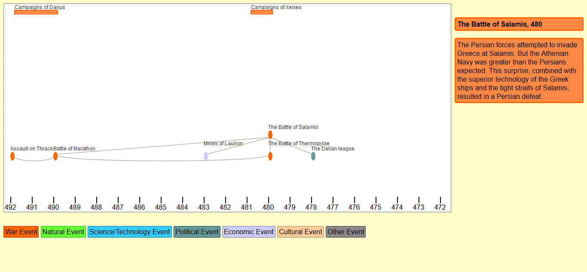

# Senior-Project
My undergrad senior project. More features may be added in the future.
Needs node.js and MySQL to run.

The server runs using node.js, interacting with a MySQL database created using script.sql (Enter "source [path to script.sql]" into mysql terminal to create database, enter "node [path to server.js]" in node command prompt to start the server.)
Create a timeline using inputtimeline.html.
Create trends using inputtrend.html.
Create events using inputevent.html.
main_view.html displays an interactive visualization of the database. The user can hover over the event bubble or trend for a description, as seen below.



## Setting Up the Database

You'll need to go through the following steps in the MySQL prompt to get this software running:

```
CREATE DATABASE historydb;
CREATE USER 'nodeman'@'localhost' IDENTIFIED BY 'node';
GRANT ALL PRIVILEGES ON * . * TO 'nodeman'@'localhost';
source ~/Senior-Project/script.sql;
```

Then run the server with the following command:

```
node server.js
```

Then you should be able to access the pages under `localhost:3000`.
